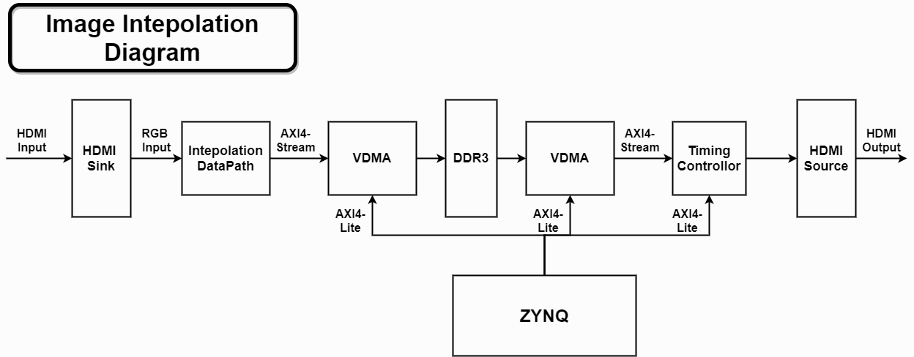
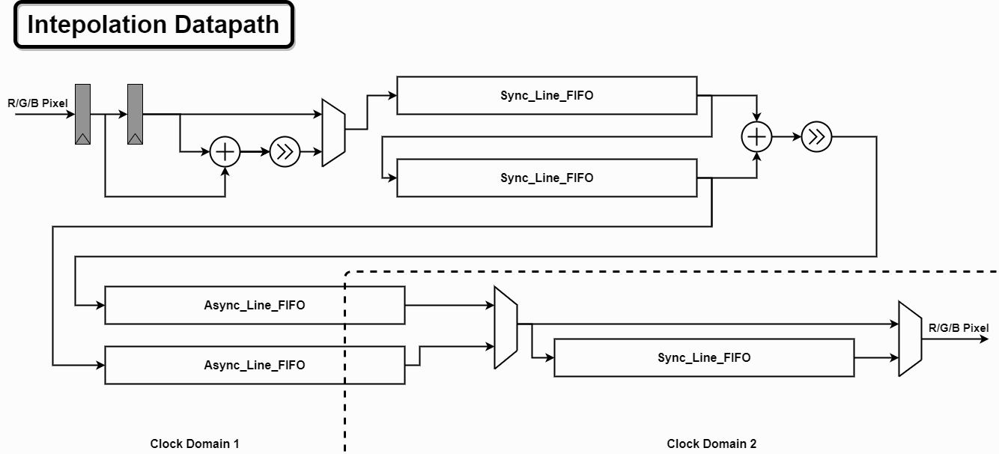

# Rebuild Template

## 1. Rebuild Vivado Project (Vivado GUI)

```tcl
cd ./proj

source ./rebuld_prj.tcl
```

## 2. Set Default IP Location

​	Tools -> Settings -> Project Settings -> IP -> IP location -> **./ip_repo/User**

## 3. Intepolation with FPGA

This project builds a simple real-time video super resolution demo using bilinear intepolation method on PYNQ-Z1. 

## 4. System Architechture

The overall dataflow of the system is showed below:



The whole system consists of 4 pipelining module: HDMI input, intepolation datapath, frame buffer(VDMA and DDR3) and HDMI output. 

The HDMI input signal (with resolution of 640$\times$480) is first input to a HDMI sink and then converted to RGB signal that will be sent to the intepolation datapath pixel by pixel per channal. Bilinear intepolation is completed in intepolation datapath where the frame resulotion will be upscaled to 1280$\times$960, which will be specified in detail later. 

Intepolated signal will be output to VDMA and buffered in the DDR3 memory afterwards to achieve frame buffering. Depth of frame buffer is set to be 3.   

Timing controller reads one frame from DDR3 memory and sends it to HDMI source. Then HDMI source will generate the final HDMI output signal. 

## 5. Intepolation Datapath

Bilinear Intepolation is realized in intepolation datapath. The stucture of intepolation datapath is showed as follow:



As is showed above, R/G/B channal input pixel is first used to complete intepolation between every pair of neighbour pixels. The reason why this works is that the clock frequency if clock domain 1 is two times of the original input signal's frequency. The adder and shitfter right after together contitudes a averaging cell used to get the average pixel value between two original pixel.  

Then the intepolated signal is sent to a synchronous line fifo, which is in fact a RAM-based shift register. As you can see, two synchronous line fifos are connected serially and their outputs are all connected to another averaging cell to generate the intepolated line. The newly generated line and the line priorly input to synchronous line fifo will be sent to two different asynchronous line fifos parallaly, so that controller in clock domain 2 can read the pixel in clock frequency that is two times of clock domain 1's. Synchronous line fifo in clock domain 2 is used to simply repeat the last line of every frame.

